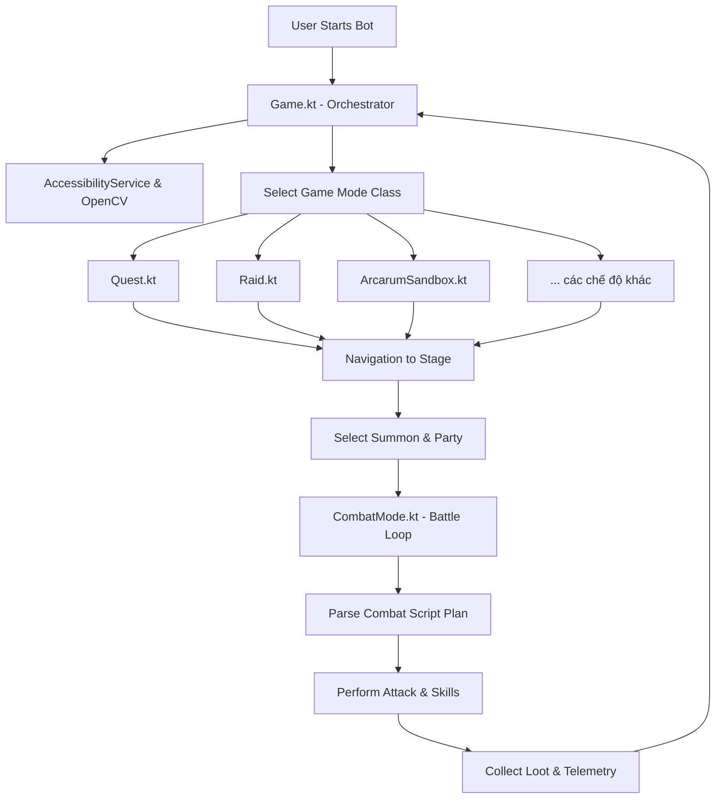

# Tổng hợp Script Điều khiển - Granblue Automation Android

Tài liệu này tổng hợp toàn bộ cấu trúc, chức năng và cơ chế hoạt động của các script điều khiển (control scripts) trong dự án **Granblue Automation Android**. Hệ thống được xây dựng bằng ngôn ngữ Kotlin cho phần core điều khiển trên Android và React Native cho giao diện cấu hình.

---

## 🗺️ Sơ đồ Kiến trúc Điều khiển

Hệ thống hoạt động theo mô hình điều phối tập trung với lớp [Game](file:///d:/resource/granblue-automation-android/android/app/src/main/java/com/steve1316/granblue_automation_android/bot/Game.kt) là trái tim điều khiển mọi luồng đi của bot.



---

## 1. Lớp Điều phối Trung tâm: [Game](file:///d:/resource/granblue-automation-android/android/app/src/main/java/com/steve1316/granblue_automation_android/bot/Game.kt)

Lớp [Game](file:///d:/resource/granblue-automation-android/android/app/src/main/java/com/steve1316/granblue_automation_android/bot/Game.kt) quản lý trạng thái của bot, khởi tạo các chế độ chơi tương ứng, điều khiển dịch vụ hỗ trợ (Accessibility Service) và xử lý luồng dừng/chạy của ứng dụng.

### Các hàm và thành phần cốt lõi của [Game](file:///d:/resource/granblue-automation-android/android/app/src/main/java/com/steve1316/granblue_automation_android/bot/Game.kt):

| Tên Hàm / Thuộc tính | Vai trò / Chức năng |
| :--- | :--- |
| `start()` | Bắt đầu vòng lặp nông trại dựa trên chế độ chơi được chọn trong cấu hình. |
| `goBackHome()` | Nhấn nút "Home" trên giao diện game để quay về trang chủ một cách an toàn. |
| `findAndClickButton()` | Tìm kiếm một nút hình ảnh (từ thư mục assets) bằng OpenCV template matching và click vào đó. |
| `selectSummon()` | Tự động lựa chọn Summon hỗ trợ tương ứng với thuộc tính (Fire, Water, Earth...) từ Summon List. |
| `resetSummons()` | Làm mới Summon bằng cách bắt đầu một Trận đấu thử (Trial Battle) tại "Gameplay Extras" rồi rút lui ngay lập tức. |
| `selectPartyAndStartMission()` | Chọn nhóm (Group) và đội hình (Party) phù hợp dựa trên các tùy chọn cài đặt và nhấn bắt đầu. |
| `collectLoot()` | Kiểm tra và thu thập vật phẩm rơi ra sau trận đấu, ghi nhận số lượng farm và đẩy dữ liệu lên API thống kê hoặc gửi webhook Discord. |
| `checkPendingBattles()` | Kiểm tra và dọn dẹp các trận đấu đang chờ nhận thưởng (Pending Battles) để tránh kẹt hàng đợi của bot. |
| `checkForCAPTCHA()` | > [!CAUTION]<br>Liên tục phát hiện nếu màn hình CAPTCHA chống bot xuất hiện. Nếu phát hiện, bot sẽ phát âm thanh cảnh báo và lập tức dừng hoạt động để bảo vệ tài khoản. |

---

## 2. Lớp Điều khiển Trận đấu: [CombatMode](file:///d:/resource/granblue-automation-android/android/app/src/main/java/com/steve1316/granblue_automation_android/bot/CombatMode.kt)

Lớp [CombatMode](file:///d:/resource/granblue-automation-android/android/app/src/main/java/com/steve1316/granblue_automation_android/bot/CombatMode.kt) chịu trách nhiệm toàn bộ quá trình chiến đấu từ lúc bước vào phó bản cho tới khi trận đấu kết thúc.

### Chức năng chính:
- **Tự động hóa hành vi**: Hỗ trợ Full Auto, Semi Auto hoặc chạy theo kịch bản (custom plan) định sẵn.
- **Xử lý sự cố**:
  - `checkForWipe()`: Phát hiện nếu toàn đội bị tiêu diệt (Party Wipe) để tiến hành rút lui hoặc thoát ra trang chủ.
  - `checkForDialog()`: Nhấn bỏ qua các hội thoại ngẫu nhiên của Lyria hoặc Vyrn xuất hiện giữa trận đấu.
- **Trình phân tích kịch bản chiến đấu (Combat Script Plan Reader)**:
  - Cho phép người dùng tùy chỉnh chính xác lượt nào sử dụng kỹ năng gì, bình thuốc gì, triệu hồi Summon nào, hoặc chọn mục tiêu quái vật nào.

### Cú pháp các lệnh chiến đấu được hỗ trợ:

> [!NOTE]
> Các câu lệnh chiến đấu được viết dưới dạng danh sách ngăn cách bởi dấu chấm `.` hoặc tham số trong dấu ngoặc đơn `()`.

#### 🧪 Bình thuốc & Vật phẩm hồi phục (`useCombatHealingItem`):
- `usegreenpotion.target(X)`: Sử dụng bình nước xanh lá hồi máu cho nhân vật ở vị trí `X` (từ 1 đến 4).
- `usebluepotion`: Sử dụng bình nước xanh dương hồi phục cho toàn đội.
- `usefullelixir`: Sử dụng bình Elixir hồi sinh toàn bộ đội hình và sạc đầy thanh Charge Bar.
- `usesupportpotion`: Sử dụng bình nước hỗ trợ từ đồng đội.
- `useclarityherb.target(X)`: Sử dụng thảo dược giải hiệu ứng bất lợi cho nhân vật ở vị trí `X`.
- `userevivalpotion`: Sử dụng bình hồi sinh đồng đội.

#### 🎯 Chọn mục tiêu quái vật (`selectEnemyTarget`):
- `targetenemy(1)`, `targetenemy(2)`, `targetenemy(3)`: Chọn mục tiêu tấn công là quái vật thứ 1, 2 hoặc 3 trên màn hình.

#### ⚡ Triệu hồi Summon (`quickSummon`):
- Thực hiện triệu hồi nhanh (Quick Summon) nếu tùy chọn được bật nhằm tối ưu hóa sát thương đầu ra.

#### 🔄 Đồng bộ Lượt và Tải lại trang (Turn Sync & Refresh):
- `startTurn(command)`: Kiểm tra lượt hiện tại của trận đấu. Nếu lượt thực tế chưa khớp với lượt yêu cầu của kịch bản, bot sẽ đánh thường liên tục cho tới khi lượt trùng khớp.
- `reloadAfterAttack()`:
  - > [!TIP]<br>Khi chế độ làm mới trận đấu được kích hoạt (đặc biệt trong các phó bản Raid hoặc Guild Wars), bot sẽ nhấn F5/Reload trang ngay khi vừa nhấn Tấn công (Attack) để bỏ qua hoạt ảnh tấn công rườm rà, tăng tốc độ farm đáng kể.

---

## 3. Các Script Chế độ chơi đặc thù (`game_modes/`)

Mỗi phó bản hoặc sự kiện trong game được quản lý bởi một file Kotlin riêng biệt nằm trong gói [game_modes](file:///d:/resource/granblue-automation-android/android/app/src/main/java/com/steve1316/granblue_automation_android/bot/game_modes):

### 📊 Bảng tổng hợp các Game Mode Scripts:

| Tên File Script | Lớp Đối Tượng | Chức Năng Chi Tiết |
| :--- | :--- | :--- |
| [Quest.kt](file:///d:/resource/granblue-automation-android/android/app/src/main/java/com/steve1316/granblue_automation_android/bot/game_modes/Quest.kt) | `Quest` | Điều hướng qua 3 vùng không phận (Skydoms): **Phantagrande** (Page 1/2), **Nalhegrande** (Page 1/2), và **Oarlyegrande**. Tự động chọn đúng đảo, chương (Chapter), số tập (Episode) và phó bản cần farm. |
| [Raid.kt](file:///d:/resource/granblue-automation-android/android/app/src/main/java/com/steve1316/granblue_automation_android/bot/game_modes/Raid.kt) | `Raid` | > [!IMPORTANT]<br>Hỗ trợ cướp phòng Raid bằng cách kết nối với Twitter API thông qua `TwitterRoomFinder`. Tự động copy mã phòng, dán mã qua Accessibility Service vào game và tham gia. Giới hạn tối đa 3 phòng cùng lúc để chờ dọn dẹp. |
| [ArcarumSandbox.kt](file:///d:/resource/granblue-automation-android/android/app/src/main/java/com/steve1316/granblue_automation_android/bot/game_modes/ArcarumSandbox.kt) | `ArcarumSandbox` | Tự động farm phó bản Replicard Sandbox. Quản lý việc di chuyển trên bản đồ Sandbox, tự động hồi năng lượng AAP, phát hiện và chiến đấu với Zone Boss khi đủ nguyên liệu, mở rương vàng (Gold Chest). |
| [Arcarum.kt](file:///d:/resource/granblue-automation-android/android/app/src/main/java/com/steve1316/granblue_automation_android/bot/game_modes/Arcarum.kt) | `Arcarum` | Automate phó bản Arcarum truyền thống (đi bàn cờ ô). Nhấn lật thẻ bài, tự động tìm rương báu, chìa khóa, đánh quái cản đường và đánh boss khu vực. |
| [Event.kt](file:///d:/resource/granblue-automation-android/android/app/src/main/java/com/steve1316/granblue_automation_android/bot/game_modes/Event.kt) | `Event` | Chạy sự kiện cốt truyện/token. Tự động kiểm tra và chuyển sang farm độ khó **Nightmare** (nếu kích hoạt), tự động quay hòm Token Drawboxes để lấy tài nguyên. |
| [GuildWars.kt](file:///d:/resource/granblue-automation-android/android/app/src/main/java/com/steve1316/granblue_automation_android/bot/game_modes/GuildWars.kt) | `GuildWars` | Tự động hóa chiến dịch Guild Wars (Unite and Fight). Hỗ trợ đi từ độ khó thấp (Very Hard, Extreme) đến các boss Nightmare (NM90, NM95, NM100, NM150). |
| [Special.kt](file:///d:/resource/granblue-automation-android/android/app/src/main/java/com/steve1316/granblue_automation_android/bot/game_modes/Special.kt) | `Special` | Quản lý nông trại các phó bản Special (như Angel Halo, Shiny Slime Search, trials nguyên tố). Phát hiện sự xuất hiện của **Dimensional Halo** để ưu tiên farm. |
| [XenoClash.kt](file:///d:/resource/granblue-automation-android/android/app/src/main/java/com/steve1316/granblue_automation_android/bot/game_modes/XenoClash.kt) | `XenoClash` | Tự động hóa nông trại sự kiện Xeno Clash và phát hiện, đánh độ khó Nightmare kích hoạt từ sự kiện. |
| [DreadBarrage.kt](file:///d:/resource/granblue-automation-android/android/app/src/main/java/com/steve1316/granblue_automation_android/bot/game_modes/DreadBarrage.kt) | `DreadBarrage` | Tự động farm phó bản sự kiện Dread Barrage từ mức độ 1 Sao đến 5 Sao. |
| [ProvingGrounds.kt](file:///d:/resource/granblue-automation-android/android/app/src/main/java/com/steve1316/granblue_automation_android/bot/game_modes/ProvingGrounds.kt) | `ProvingGrounds` | Tự động farm đấu trường Proving Grounds (hỗ trợ chuyển đổi đội hình chiến đấu cho các vòng đấu liên tiếp). |
| [Coop.kt](file:///d:/resource/granblue-automation-android/android/app/src/main/java/com/steve1316/granblue_automation_android/bot/game_modes/Coop.kt) | `Coop` | Tự động hóa tạo phòng hoặc tham gia phòng Coop sẵn có trong lobby. |
| [ROTB.kt](file:///d:/resource/granblue-automation-android/android/app/src/main/java/com/steve1316/granblue_automation_android/bot/game_modes/ROTB.kt) | `ROTB` | Tự động farm sự kiện Rise of the Beasts, phát hiện boss Extreme+ (Shenxian) để tham gia chiến đấu nâng cao. |
| [Generic.kt](file:///d:/resource/granblue-automation-android/android/app/src/main/java/com/steve1316/granblue_automation_android/bot/game_modes/Generic.kt) | `Generic` | Chế độ nông trại chung, chỉ lặp lại nhấn nút "Play Again" hoặc tự động tấn công khi phát hiện trận đấu đang diễn ra. |

---

## 🛠️ Luồng Thực Thi Điển Hình (Workflow) của một Game Mode

Hầu hết các script chế độ chơi đều tuân thủ cấu trúc hàm `start(firstRun: Boolean)` hoặc `start()` với quy trình hoạt động như sau:

```kotlin
fun start(firstRun: Boolean) {
    // 1. Điều hướng (Navigation) hoặc bấm Chơi Lại (Play Again)
    if (firstRun) {
        navigate() 
    } else if (game.findAndClickButton("play_again")) {
        game.checkForPopups()
    } else {
        game.checkPendingBattles()
        navigate()
    }

    // 2. Kiểm tra năng lượng (AP/EP)
    game.checkAP()

    // 3. Chọn Summon đồng đội
    if (game.imageUtils.confirmLocation("select_a_summon")) {
        if (game.selectSummon()) {
            // 4. Chọn Đội hình và Bắt đầu trận đấu
            if (game.selectPartyAndStartMission()) {
                // 5. Bắt đầu chế độ Chiến đấu (Combat Mode)
                if (game.combatMode.startCombatMode()) {
                    // 6. Thu thập chiến lợi phẩm (Loot)
                    game.collectLoot(isCompleted = true)
                }
            }
        }
    }
}
```

---

## 4. Các Script Tiện ích bổ trợ (Utilities)

Bên cạnh các script điều phối và chế độ chơi, hoạt động tự động hóa còn dựa trên các lớp bổ trợ quan trọng:

- **[CustomImageUtils.kt](file:///d:/resource/granblue-automation-android/android/app/src/main/java/com/steve1316/granblue_automation_android/utils/CustomImageUtils.kt)**:
  - Cung cấp các thuật toán OpenCV để so khớp mẫu ảnh (template matching) nhằm nhận diện chính xác các nút bấm, Summon, giao diện loot đồ, và vị trí của các thông báo lỗi hoặc CAPTCHA.
  - Hỗ trợ căn chỉnh tỷ lệ (scaling) và độ tự tin khớp mẫu (confidence limit) tùy biến theo độ phân giải màn hình thiết bị (FHD, 720p, Máy tính bảng).
- **[TwitterRoomFinder.kt](file:///d:/resource/granblue-automation-android/android/app/src/main/java/com/steve1316/granblue_automation_android/utils/TwitterRoomFinder.kt)**:
  - Kết nối với Twitter API thông qua thư viện Twitter4j để liên tục theo dõi và trích xuất các mã phòng Raid mới nhất do người chơi khác chia sẻ trên mạng xã hội.
- **[CustomJSONParser.kt](file:///d:/resource/granblue-automation-android/android/app/src/main/java/com/steve1316/granblue_automation_android/utils/CustomJSONParser.kt)**:
  - Đọc và phân tích cú pháp các tập tin cấu hình JSON dùng để lưu trữ danh sách Summon, thông tin phó bản và các kịch bản chiến đấu tùy biến của người dùng.
